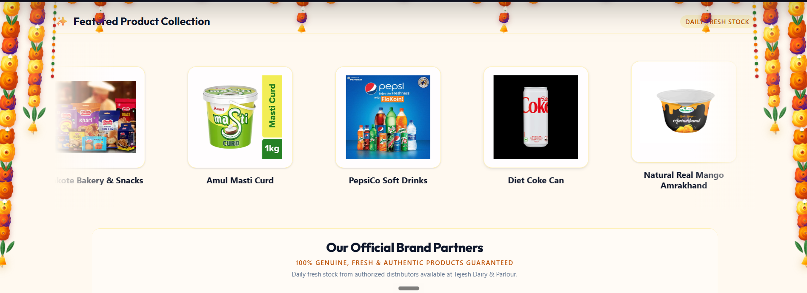
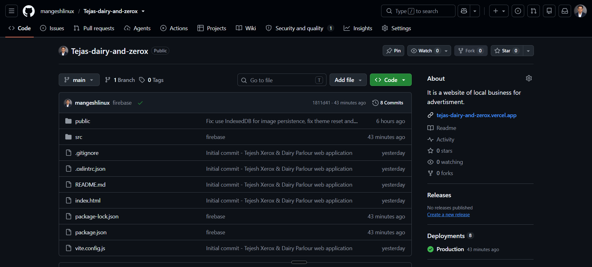
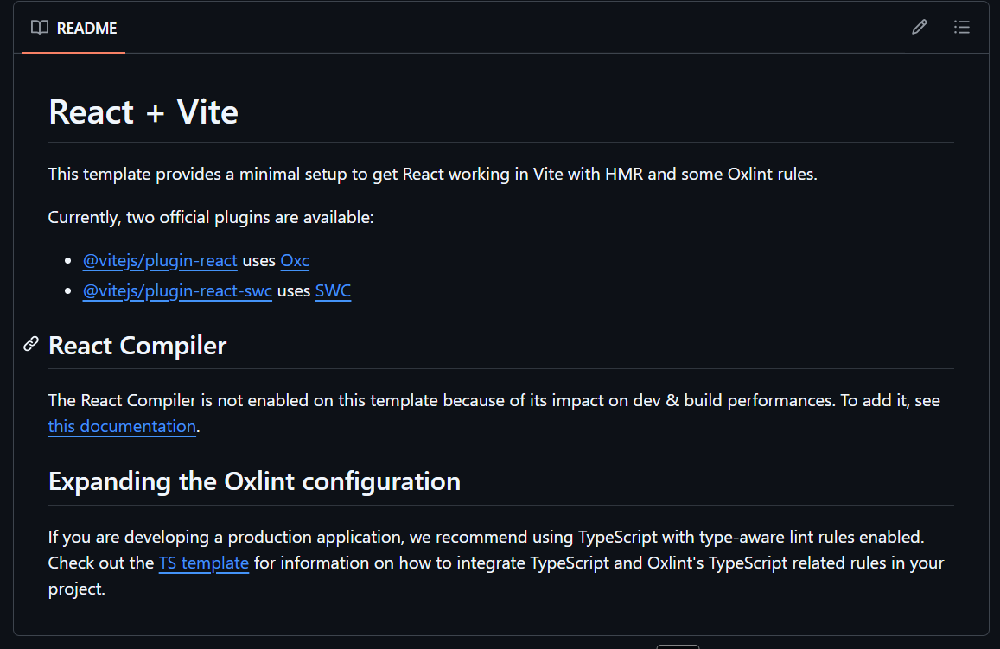

# Tejesh Xerox, Milk & Ice Cream Parlour

A bilingual (English + Marathi) business website for **Tejesh Xerox, Milk & Ice Cream Parlour** in Killari. It shows the shop's dairy products, offers, brand partners and printing/form-filling services, so local customers can find everything in one place.

🔗 **Live site:** [tejas-dairy-and-zerox.vercel.app](https://tejas-dairy-and-zerox.vercel.app)

---

## Screenshots

### Home


### Offers Banner


### Featured Products


### Official Brand Partners


---

## Features

- Bilingual content (English and Marathi)
- Hero section with a shop photo and location tag
- Sliding offers banner (for example, Shrikhand Natural at ₹48)
- Featured product collection with daily fresh stock
- Official brand partners: Amul, Natural Milk, Coca-Cola, Pepsi, Sprite, Red Bull, Monster, Sting, Chakote
- Festive marigold-garland theme
- Images saved in the browser using IndexedDB
- Firebase integration
- Fully responsive layout

## Services

- Amul ice cream, fresh milk, paneer, curd, lassi and other dairy products
- Soft drinks, energy drinks, bakery and snacks
- High-speed xerox, lamination and binding
- Online government and college form filling

## Tech Stack

| Part | Technology |
|------|------------|
| Frontend | React + Vite |
| Backend / Data | Firebase |
| Image storage | IndexedDB (browser) |
| Linting | Oxlint |
| Hosting | Vercel |

## Getting Started

1. Clone the repository
   ```bash
   git clone https://github.com/mangeshlinux/Tejas-dairy-and-zerox.git
   cd Tejas-dairy-and-zerox
   ```
2. Install dependencies
   ```bash
   npm install
   ```
3. Start the development server
   ```bash
   npm run dev
   ```
4. Open the local URL shown in the terminal (usually `http://localhost:5173`).

To create a production build:
```bash
npm run build
```

## Project Structure

```
├── public/          # Static files and images
├── src/             # React components and app code
├── index.html
├── package.json
└── vite.config.js
```

## Deployment

The site is deployed on Vercel. Every push to the `main` branch is deployed automatically.

## Author

**Mangesh Late** ([@mangeshlinux](https://github.com/mangeshlinux))

## License

This project was made for a local business. All shop names, logos and brand images belong to their respective owners.
